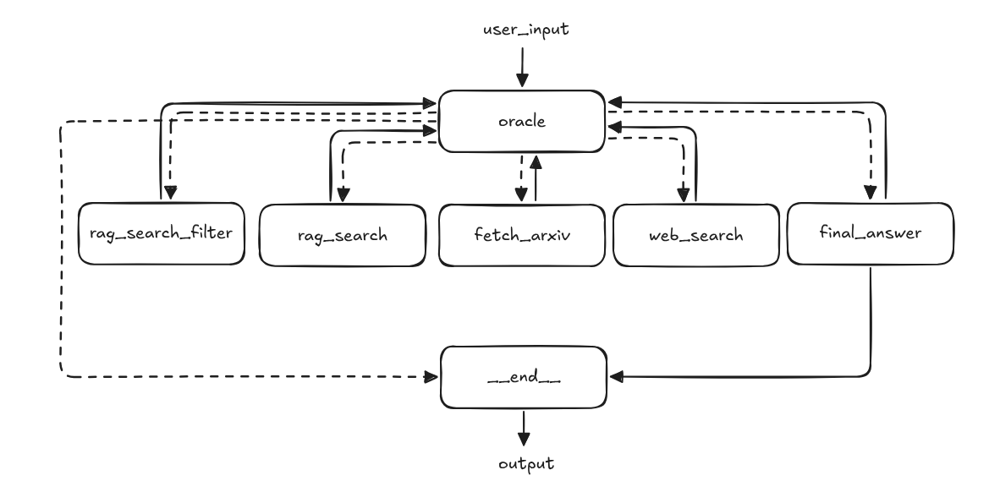

# ScaleX-Innovation-Technical-Challenge

[ScaleX Innovation] AI Engineer Technical Challenge

- Project #1: Project Title: Multi-Source RAG Chatbot

- Video: [ScaleX Innovation Technical Challenge - 2025 04 17 16 31 16](https://youtu.be/IXFS6rKlMF0)

Langgraph Bot Architecture

  

- oracle: the decision maker, an llm with a pre-defined prompt with access to all of the tools we made (rag_search_filter, rag_search, fetch_arxiv, web_search, and final_answer); given the user query, it decides which tool(s) to use, in the context of our project:
  - native llm response: go directly to "final_answer" without using any other tools
  - vector store-based rag: use the rag\_\* tools before returning an answer
  - web search-based: leverage the web_search tool to access online resources

Tools used:

- langchain + langgraph: for building the bot architecture itself along with the tools
- open ai gpt-4o: our llm (large language model) of choice
- pinecone: vector store
- serp api: web search api
- chatgpt.com: (+ windsurf) as coding assistants and for troubleshooting purposes
